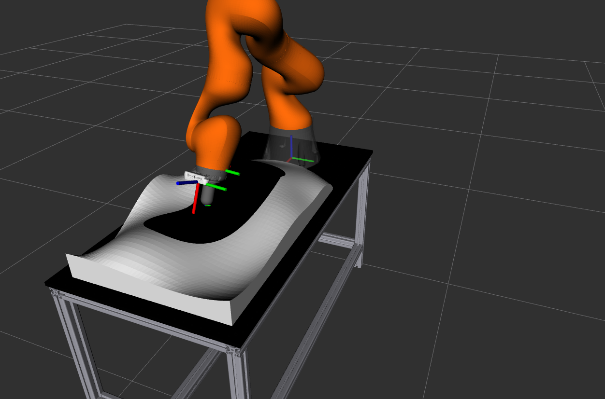
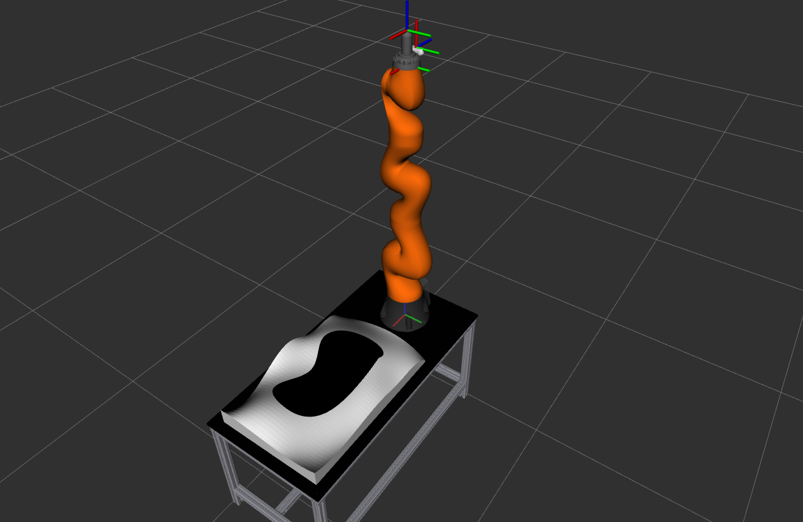

Репозиторий содержит программное обеспечение для
подготовки и сдачи задания категории _Магистратура_  направления Робототехники олимпиады [Я - Профессионал](https://yandex.ru/profi/courses2020).

Данное программное обеспечение, в исходном, предоставляемом участникам виде, будет использоваться для проведения оценки заданий участников.

Предоставялемое программное обеспечение включает:

* ROS-пакеты для симуляции 7-ми звенного манипулятора KUKA IIWA внутри симулятора gazebo.

* Визуализацию симуляции в среде Rviz.

Работа с пакетом предполагается из docker-контейнера, предоставляемого участникам в составе [основного репозитория олимпиады](https://gitlab.com/beerlab/iprofi2021/profi2021_robotics), соответственно, предоставляемые далее инструкции требуют предварительно выполнить инструкции, представленные в нем.

#### Установка программного обеспечения

1. В новом терминале вне docker-контейнера перейдите в корневую директорию основного репозитория олимпиады и склонируйте данный репозиторий в рабочее окружение выполнив:

        cd workspace/src
        git clone https://gitlab.com/beerlab/iprofi2021/profi2021_master_scene.git

3. Откройте bash-сессию **внутри контейнера**, перейдите в смонтированное рабочее окружение и соберите все пакеты:

        bash docker/into_docker.sh
        cd /workspace
        catkin build

#### Описание программного обеспечения

1. Для запуска симулятора в новой bash-сессии **внутри контейнера** запустите соответствующий launch-файл:

        roslaunch profi2021_master_scene start_scene.launch

   После запуска launch-файла на сцене в rviz появится манипулятор.

   

   В случае если участнику привычнее работать с графическим окружением gazebo, он может запускать указанный launch-файл со следующим аргументом:

        roslaunch profi2021_master_scene start_scene.launch gui:=true

2. Для управления манипулятором доступно два варианта контроллеров, привязанных к каждому звену: _torque_controller_ и _position_controller_. Переключение между двуми данными контроллерами возможно при вызове соответствующего сервиса. Для переключения с _position_controller_ на _torque_controller_ вызов сервиса будет выглядеть следующим образом (подробнее об [controller_manager](http://wiki.ros.org/controller_manager)):

        rosservice call /iiwa/controller_manager/switch_controller "{start_controllers: ['joint1_torque_controller'], stop_controllers: ['joint1_position_controller'], strictness: 1}"

    Стоит помнить что, для предоставления решения вызов сервиса, необходимо производить внутри кода, пример вызова сервиса внутри кода представлен в репозитории с решением.

3. Управление манипулятором осуществляется через топики, указанные ниже, по отдельности для каждого звена посредством [Float64.msg](https://docs.ros.org/en/api/std_msgs/html/msg/Float64.html):

        /iiwa/joint1_position_controller/command, ... , /iiwa/joint7_position_controller/command

    или для режима управления _torque_controller_:

          /iiwa/joint1_torque_controller/command, ... , /iiwa/joint7_torque_controller/command

4. Изображение с камеры, установленной на манипуляторе доступно из соответствующего [топика */iiwa/camera1/image_raw*](https://docs.ros.org/en/melodic/api/sensor_msgs/html/msg/Image.html).
  Информацию с датчика силы, установленного на конце 7 звена можно получить из [топика */iiwa/state/CartesianWrench*](http://docs.ros.org/en/hydro/api/brics_actuator/html/msg/CartesianWrench.html)

        rostopic echo /iiwa/state/CartesianWrench

3. Для реализации решения, вам предоставлен репозиторий с шаблоном ros-пакета, доступный по [ссылке](https://gitlab.com/beerlab/iprofi2021/profi2021_master_solution)
